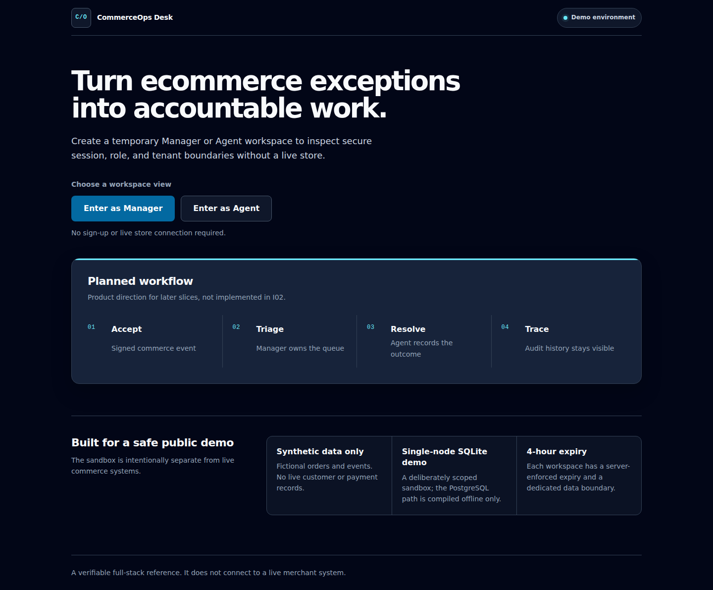
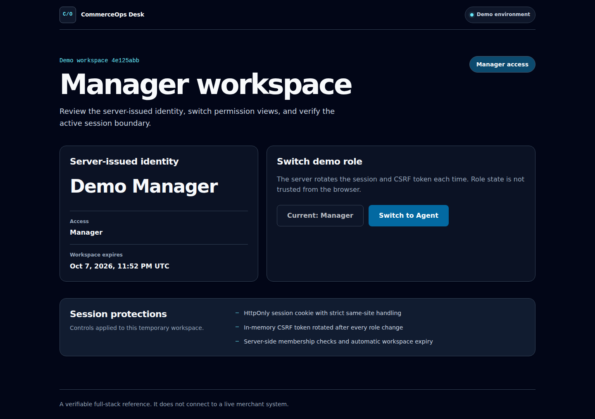

# CommerceOps Desk

CommerceOps Desk is a security-conscious full-stack case study for handling ecommerce payment, refund, fulfilment, and event-processing exceptions. The project is delivered in small, verifiable slices: a capability is called complete only when the implementation, automated tests, and operating evidence are present.

All demo identities and records are synthetic. The application does not connect to a store or perform real payment, refund, or fulfilment actions.



## Current verified scope

**I02 — Demo identity and access boundaries** includes the hosted foundation from I01 and adds:

- One-click temporary Manager and Agent workspaces, with session recovery after refresh and a server-enforced four-hour expiry.
- Opaque, server-side sessions stored as keyed hashes; the browser receives an HttpOnly, `SameSite=Strict` cookie and never stores the session in web storage.
- Origin host-and-port checks, an in-memory synchronizer token for cookie-authenticated writes, and session plus CSRF rotation when the active role changes.
- Server-authoritative memberships, explicit role guards, tenant-scoped foreign keys, and not-found behavior for cross-organization resources.
- Database-backed idempotency for workspace creation and role changes. Exact retries recover the original logical response and cookie, while reuse with another payload returns `409`; receipts store no plaintext source address, cookie, or CSRF token.
- Same-role requests are zero-write no-ops. Real role changes are capped by a persistent, configurable per-workspace quota (32 by default), and exact replays do not consume it twice.
- Persistent per-source creation limits and an active-workspace capacity guard. The hosted launcher disables Uvicorn proxy rewriting, so only the application evaluates forwarded addresses and only through configured trusted hops.
- Bounded API request bodies and compact validation failures so malformed input cannot be reflected into an amplified response.
- A stable single-node demo secret, strict secret-file permissions, and a production fail-closed rule that requires an explicitly supplied session secret.



The current UI intentionally stops at identity and access boundaries. Webhook ingestion, exception cases, assignment, resolution, retries, and recovery remain planned and are not represented as working features.

## Architecture

```text
React + TypeScript
        |
same-origin HTTP API
        |
FastAPI + Pydantic
        |
SQLAlchemy + Alembic
        |
SQLite public demo / PostgreSQL DDL compiled offline
```

The frontend treats session data as server-issued state. The API resolves every request back to a persisted membership and organization; role and tenant decisions are not trusted from browser fields.

See the [design summary](docs/design-summary.md) for the delivery roadmap and the [security model](docs/security-model.md) for the threat boundaries and known limits.

## Run locally

The supported development path expects Linux, Bash, GNU Make, Python 3.12, Node 22, and npm.

```bash
cp .env.example .env
make setup
make run
```

The safe example configuration starts at `http://localhost:8000` with a local SQLite database. `make run` builds the frontend and loads `.env`; if `.env` is absent, it uses the non-secret development defaults in `.env.example`.

Run the complete I02 gate with:

```bash
make verify
```

The gate covers backend and frontend tests, an empty-database migration proof, hosted startup, desktop and mobile browser journeys, Python and TypeScript static checks, a production frontend build, and a scan of both the worktree and reachable Git history for recognized secrets and internal identifiers.

## Deployment limits

The public demo is deliberately single-node and uses SQLite with WAL and a busy timeout. PostgreSQL SQL and Alembic migration DDL are compiled offline only; no live PostgreSQL migration, transaction, locking, or concurrency test has run. This revision makes no high-availability, production-scale, customer-outcome, or exactly-once claim.

## Planned product workflow

```text
signed synthetic webhook
  -> immutable event and transactional outbox
  -> deterministic exception detection
  -> manager assignment
  -> agent investigation and resolution
  -> append-only audit timeline
  -> retry, dead-letter, and manual reprocessing
```

Each later capability must pass its own release gate before it moves into the verified scope.

## License

[MIT](LICENSE)
