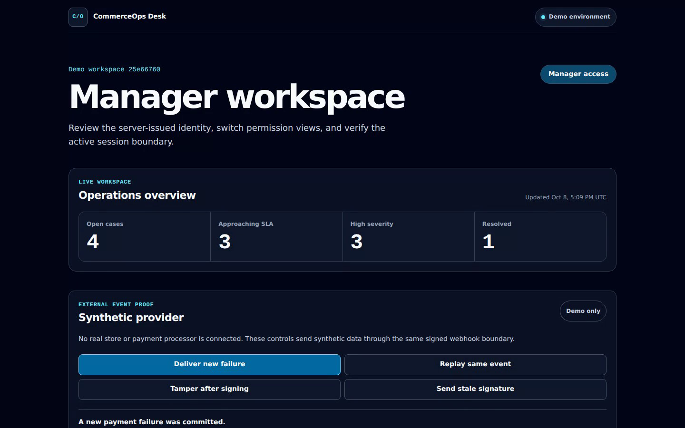
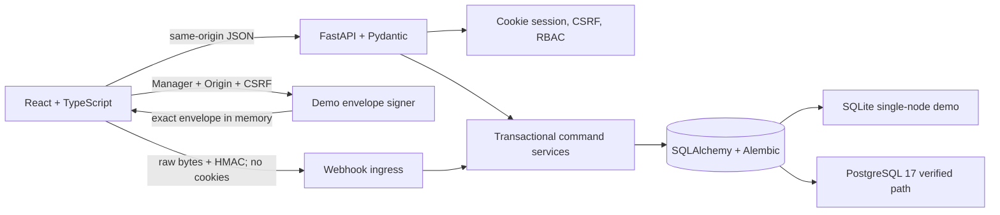

# CommerceOps Desk

[](https://github.com/Zhang-ZhengHao/commerce-ops-desk/actions/workflows/verify.yml)
[](https://github.com/Zhang-ZhengHao/commerce-ops-desk/releases)
[](LICENSE)

A working full-stack operations desk for triaging ecommerce payment, refund, and fulfillment exceptions. Managers can assign organization-wide work; Agents can investigate and resolve only their own cases. Case writes are version-checked and retry-safe, access is tenant-scoped, material actions are auditable, and a Manager-only synthetic provider UI can exercise a signed payment-failure webhook through the real ingress path.

All identities, orders, and outcomes are synthetic. The demo never connects to a store or performs a real payment, refund, or fulfillment action.

The repository currently contains the `v0.2.1` evaluator candidate. This
release-facing checkpoint does not publish a live evaluator URL or claim that
the candidate has been deployed or released.


## What you can verify

- **Manager workflow:** inspect the dashboard, filter the queue, open an order summary, assign or reassign a case, add an internal note, and resolve with a rule-specific reason.
- **Agent boundary:** see only assigned cases, add notes to owned work, and submit an allowed resolution. Unassigned and cross-organization records return `404`.
- **Concurrency behavior:** optimistic case versions return `409`; idempotency keys replay the same compact result, while concurrent key reuse with another payload returns a stable conflict instead of a server error.
- **Accountable history:** each assignment, note, and resolution records a stable action key and case version. Audit events with equal timestamps still render in case-version order.
- **Disposable demo controls:** sessions and CSRF tokens rotate on role changes, note growth is bounded per workspace, and Reset replaces only the active synthetic tenant.
- **Manager-only synthetic provider:** request a server-signed envelope, deliver a `fresh` event, replay its exact bytes with `replay`, change one post-signing byte with `tamper`, or request a timestamp older than the acceptance window with `stale`.
- **Signed machine ingress:** the ingress first enforces a canonical raw path, then HMAC-authenticates the timestamp, integration ID, event ID, and exact raw body bytes before media-type or JSON parsing. Exact delivery replays return the committed case; a different valid raw-body encoding under the same event ID returns `409`.
- **Safe provenance:** seeded and synthetic-webhook cases are distinguished in the queue and detail view. Synthetic cases expose only provider, event type, constrained external event ID, and receipt time—not integration IDs, digests, signatures, headers, or raw bodies.
- **Unknown-outcome recovery:** the UI never automatically resends after an ambiguous delivery. If delivery committed but the refresh failed, Recovery repeats only the GET reads and opens the already-created case.
- **Live PostgreSQL evidence:** a PostgreSQL 17 CI job runs fresh and repeat migrations, tenant constraints, transaction and lock races, webhook concurrency, and the hardened production container readiness path.
- **Guided evaluation:** the entry screen and both workspaces retain one
  accessible five-step guide covering synthetic event creation, replay and
  tamper boundaries, assignment, Agent work, and the final provenance/audit
  check. The guide performs no action and records no progress.
- **Build identity:** `GET /api/build` returns only the fixed service name,
  version `0.2.1`, and either a complete lowercase 40-character source SHA or
  `null` for an unverified local build. The footer validates that response,
  renders `v0.2.1`, never blocks operational UI on metadata failure, and builds
  verified commit links from the fixed public repository origin.

### Walkthrough

1. **Create an event:** enter as **Manager**, find the synthetic provider panel,
   deliver a `fresh` payment failure, and open the generated case.
2. **Test the boundary:** use `replay` to confirm one effect, `tamper` to confirm
   that changing one signed body byte is rejected, and `stale` to confirm that
   an envelope 301 seconds outside the accepted age is rejected.
3. **Assign the case:** Manager assigns the generated case to **Demo Agent**.
4. **Work as Agent:** switch to **Agent**, reopen the assigned case, and use
   fictional text only. Agent adds a note and resolves the case with an allowed
   reason.
5. **Verify the trail:** inspect safe provenance and the ordered audit
   history.

For the internal-note field: `Use fictional text only. Do not enter personal, customer, credential, or confidential data.`



[Watch the 139-second v0.2 walkthrough](https://github.com/Zhang-ZhengHao/commerce-ops-desk/releases/tag/v0.2.0).

### Evaluator boundary

The `v0.2.1` candidate is designed for an access-controlled evaluator behind
an enterprise gateway, not an unrestricted public sandbox. The gateway owns
the access-code challenge; the application and repository do not collect,
store, log, or publish that code. Access is shared separately with an invited
evaluator only after deployment acceptance and administrator confirmation.

Live evaluator: single-node SQLite; PostgreSQL 17: CI-verified path only

That line is a capacity and evidence boundary, not a live-deployment or
production-readiness claim. The public `v0.2.0` release and walkthrough remain
the fallback until the evaluator candidate has passed the separate deployment,
release, and provenance gates.

## Architecture



The browser never supplies trusted role or tenant state. Each request resolves its opaque cookie back to the persisted session, membership, and organization. Composite tenant foreign keys, conditional updates, database constraints, and negative authorization tests reinforce that boundary below the UI.

Case writes store only `{case_id, version}` in command receipts. The frontend reads the authoritative detail after a successful write and distinguishes a committed command from a failed refresh, so retrying the screen cannot repeat the mutation.

The complete signed envelope remains only in the panel's React memory; it is not placed in storage, URLs, application logs, or error objects. The UI renders the allowlisted provider event ID, but never the target path, raw body, timestamp, or signature. The signer call uses the Manager's cookie and CSRF token, while delivery uses `credentials: "omit"`. Replay reuses the byte-identical cached envelope, tamper changes a copy, and stale testing does not replace the fresh cache. The signing route is absent in production even if demo mode is accidentally configured there.

## Run locally

The supported development path uses Linux, Bash, GNU Make, Python 3.12, Node 22, and npm.

```bash
cp .env.example .env
make setup
make run
```

Open `http://localhost:8000`. The example configuration uses a local SQLite file and non-secret development settings.

Run the main SQLite and full-stack gate used by CI:

```bash
make verify
```

It covers backend and frontend tests, fresh migrations, hosted startup, desktop and mobile browser journeys, Python and TypeScript static checks, the production bundle, and a scan of the worktree plus reachable Git history for recognized secrets and internal identifiers.

CI runs the live PostgreSQL 17 migration, concurrency, webhook, and production-container gate as a separate parallel job through the `postgres-*` Make targets.

### Run as a container

The multi-stage image builds the React bundle with Node and ships only the Python runtime. It runs as a non-root user and keeps the demo database plus generated session secret in `/app/data`.

```bash
SOURCE_SHA="$(git rev-parse HEAD)"
docker build --build-arg "SOURCE_SHA=$SOURCE_SHA" -t commerce-ops-desk:0.2.1 .
docker volume create commerce-ops-desk-data
docker run --rm --name commerce-ops-desk \
  -p 127.0.0.1:8000:8000 \
  -e COMMERCE_OPS_COOKIE_SECURE=false \
  -v commerce-ops-desk-data:/app/data \
  commerce-ops-desk:0.2.1
```

The cookie override is only for direct local HTTP. Keep secure cookies enabled when TLS terminates in front of the container.

### Review the deployment contract

The repository includes a scoped [workstation deployment runbook](deploy/workstation/RUNBOOK.md) with immutable-image verification, an isolated candidate, exact Caddy route checks, a root-owned linear rollback ledger, current-head-only replay protection, and explicit fatal-stop reconciliation. These versioned assets are reviewable engineering evidence; they are not a claim that a particular public deployment or production SLA has been verified.

Settings and local development default webhook intake off. The hosted demo launcher enables it by default and creates or reuses an isolated `data/.webhook-secret`. Production keeps it off unless `COMMERCE_OPS_WEBHOOK_ENABLED=true`; when enabled, production requires an independent `COMMERCE_OPS_WEBHOOK_MASTER_SECRET` or validated `COMMERCE_OPS_WEBHOOK_MASTER_SECRET_FILE` with mode `0600`. The current endpoint accepts only the closed synthetic `payment.failed` schema; it is not a real provider adapter.

## Verified scope and limits

The current 0.2.1 candidate hardens the hosted portfolio boundary around the I01 foundation, I02 demo identity boundary, I03 order/case vertical slice, and I04 signed-webhook simulator slice. SQLite is intentionally limited to the single-node disposable demo. Hosted SQLite is placed on a host-local filesystem because WAL is unsafe on the workspace's NFS mount.

PostgreSQL 17 migration, constraint, readiness, transaction, and selected concurrency behavior run against a live service in CI. The signed webhook uses an HMAC-authenticated inbox and one business transaction; it is synchronous, synthetic, and safely supports retries from an at-least-once sender rather than claiming exactly-once delivery.

The project has no real Stripe or Shopify adapter, asynchronous job queue or
outbox/worker, automatic delivery retry, dead-letter queue (DLQ), exactly-once
guarantee, high availability claim, production-ready claim, production SLA, or
performance claim. Overlapping-key rotation and real commerce-provider
credentials are also outside this slice.

See the [design summary](docs/design-summary.md) and [security model](docs/security-model.md) for the exact boundaries and evidence.

## Suitable project work

This repository is representative of the work I can deliver for API-backed internal tools, role-based dashboards, audited workflows, and reliability-focused full-stack systems. To discuss a project, contact me through [my GitHub profile](https://github.com/Zhang-ZhengHao). Technical reviewers can also use the [engineering feedback form](https://github.com/Zhang-ZhengHao/commerce-ops-desk/issues/new?template=engineering-feedback.yml) with synthetic data and a reproducible case.

## License

[MIT](LICENSE)
