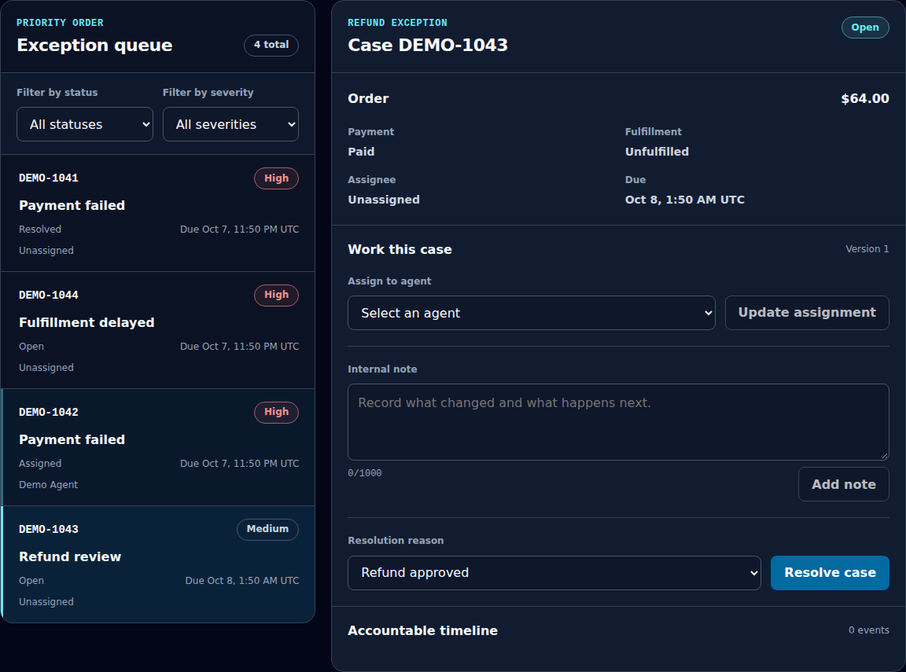
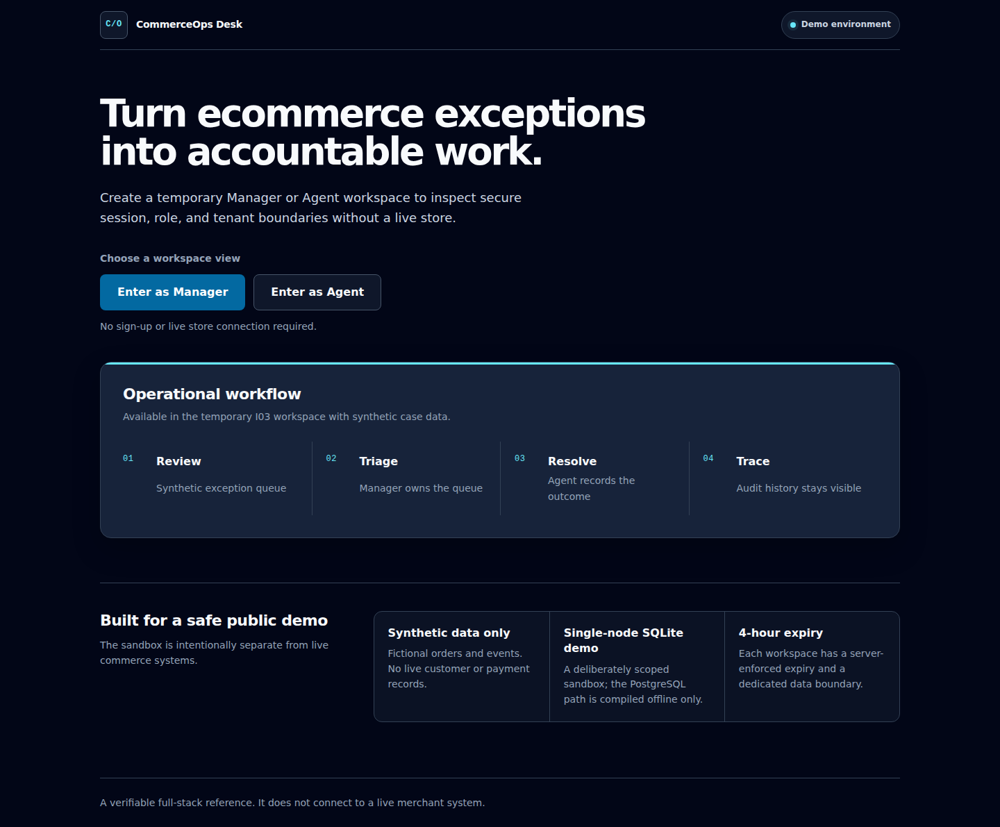
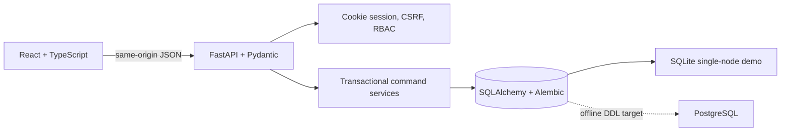

# CommerceOps Desk

[](https://github.com/Zhang-ZhengHao/commerce-ops-desk/actions/workflows/verify.yml)
[](https://github.com/Zhang-ZhengHao/commerce-ops-desk/releases)
[](LICENSE)

A working full-stack operations desk for triaging ecommerce payment, refund, and fulfillment exceptions. Managers can assign organization-wide work; Agents can investigate and resolve only their own cases. Case writes are version-checked and retry-safe, access is tenant-scoped, and material actions are auditable.

All identities, orders, and outcomes are synthetic. The demo never connects to a store or performs a real payment, refund, or fulfillment action.



## What you can verify

- **Manager workflow:** inspect the dashboard, filter the queue, open an order summary, assign or reassign a case, add an internal note, and resolve with a rule-specific reason.
- **Agent boundary:** see only assigned cases, add notes to owned work, and submit an allowed resolution. Unassigned and cross-organization records return `404`.
- **Concurrency behavior:** optimistic case versions return `409`; idempotency keys replay the same compact result, while concurrent key reuse with another payload returns a stable conflict instead of a server error.
- **Accountable history:** each assignment, note, and resolution records a stable action key and case version. Audit events with equal timestamps still render in case-version order.
- **Disposable demo controls:** sessions and CSRF tokens rotate on role changes, note growth is bounded per workspace, and Reset replaces only the active synthetic tenant.

### 90-second walkthrough

1. Enter as **Manager** and open `DEMO-1043`.
2. Assign the refund review to **Demo Agent**.
3. Switch to Agent, reopen the case, add an investigation note, and resolve it.
4. Inspect the timeline, then use **Reset demo data** to restore a clean workspace.



## Architecture



The browser never supplies trusted role or tenant state. Each request resolves its opaque cookie back to the persisted session, membership, and organization. Composite tenant foreign keys, conditional updates, database constraints, and negative authorization tests reinforce that boundary below the UI.

Case writes store only `{case_id, version}` in command receipts. The frontend reads the authoritative detail after a successful write and distinguishes a committed command from a failed refresh, so retrying the screen cannot repeat the mutation.

## Run locally

The supported development path uses Linux, Bash, GNU Make, Python 3.12, Node 22, and npm.

```bash
cp .env.example .env
make setup
make run
```

Open `http://localhost:8000`. The example configuration uses a local SQLite file and non-secret development settings.

Run the same release gate used by CI:

```bash
make verify
```

It covers backend and frontend tests, fresh migrations, hosted startup, desktop and mobile browser journeys, Python and TypeScript static checks, the production bundle, and a scan of the worktree plus reachable Git history for recognized secrets and internal identifiers.

### Run as a container

The multi-stage image builds the React bundle with Node and ships only the Python runtime. It runs as a non-root user and keeps the demo database plus generated session secret in `/app/data`.

```bash
docker build -t commerce-ops-desk:0.1.0 .
docker volume create commerce-ops-desk-data
docker run --rm --name commerce-ops-desk \
  -p 8000:8000 \
  -e COMMERCE_OPS_COOKIE_SECURE=false \
  -v commerce-ops-desk-data:/app/data \
  commerce-ops-desk:0.1.0
```

The cookie override is only for direct local HTTP. Keep secure cookies enabled when TLS terminates in front of the container.

## Verified scope and limits

This release contains the I01 hosted foundation, I02 demo identity boundary, and I03 order/case vertical slice. SQLite is intentionally limited to the single-node disposable demo. Hosted SQLite is placed on a host-local filesystem because WAL is unsafe on the workspace's NFS mount.

PostgreSQL models and migration DDL compile offline, but no live PostgreSQL migration, locking, or concurrency result is claimed yet. Signed webhook intake, transactional outbox processing, retries, dead-letter recovery, and real commerce-provider adapters remain roadmap work; the interface does not present them as implemented.

See the [design summary](docs/design-summary.md) and [security model](docs/security-model.md) for the exact boundaries and evidence.

## Suitable project work

This repository is representative of the work I can deliver for API-backed internal tools, role-based dashboards, audited workflows, and reliability-focused full-stack systems. To discuss a project, contact me through [my GitHub profile](https://github.com/Zhang-ZhengHao).

## License

[MIT](LICENSE)
